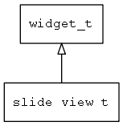

## slide\_view\_t
### 概述


 滑动视图。

 滑动视图可以管理多个页面，并通过滑动来切换当前页面。也可以管理多张图片，让它们自动切换。

 slide\_view\_t是[widget\_t](widget_t.md)的子类控件，widget\_t的函数均适用于slide\_view\_t控件。

 在xml中使用"slide\_view"标签创建滑动视图控件。如：

 ```xml
   <slide_view x="0" y="0" w="100%" h="100%" style="dot">
   <view x="0" y="0" w="100%" h="100%" children_layout="default(w=60,h=60,m=5,s=10)">
    ...
   </view>
   <view x="0" y="0" w="100%" h="100%" children_layout="default(w=60,h=60,m=5,s=10)">
    ...
   </view>
   </slide_view>
 ```

 > 更多用法请参考：[slide_view.xml](
https://github.com/zlgopen/awtk/blob/master/demos/assets/default/raw/ui/slide_view.xml)

 在c代码中使用函数slide\_view\_create创建滑动视图控件。如：

 ```c
 slide_view = slide_view_create(win, 0, 0, win->w, win->h);
 ```

 > 完整示例请参考：
 [slide_view demo](
 https://github.com/zlgopen/awtk-c-demos/blob/master/demos/slide_view.c)

 可用通过style来设置控件的显示风格，如背景颜色和指示器的图标等等。如：

 ```xml
 <style name="dot">
   <normal  icon="dot" active_icon="active_dot"/>
 </style>
 ```

 > 如果希望背景图片跟随滚动，请将背景图片设置到页面上，否则设置到slide\_view上。

 > 更多用法请参考：[theme default](
 https://github.com/zlgopen/awtk/blob/master/demos/assets/default/raw/styles/default.xml#L458)


----------------------------------
### 函数
<p id="slide_view_t_methods">

| 函数名称 | 说明 | 
| -------- | ------------ | 
| <a href="#slide_view_t_slide_view_cast">slide\_view\_cast</a> | 转换为slide_view对象(供脚本语言使用)。 |
| <a href="#slide_view_t_slide_view_create">slide\_view\_create</a> | 创建slide_view对象 |
| <a href="#slide_view_t_slide_view_set_active">slide\_view\_set\_active</a> | 设置当前页的序号。 |
| <a href="#slide_view_t_slide_view_set_anim_hint">slide\_view\_set\_anim\_hint</a> | 设置页面切换动画。 |
| <a href="#slide_view_t_slide_view_set_auto_play">slide\_view\_set\_auto\_play</a> | 设置为自动播放模式。 |
| <a href="#slide_view_t_slide_view_set_loop">slide\_view\_set\_loop</a> | 设置循环切换模式。 |
| <a href="#slide_view_t_slide_view_set_vertical">slide\_view\_set\_vertical</a> | 设置为上下滑动(缺省为左右滑动)。 |
### 属性
<p id="slide_view_t_properties">

| 属性名称 | 类型 | 说明 | 
| -------- | ----- | ------------ | 
| <a href="#slide_view_t_anim_hint">anim\_hint</a> | char* | 页面切换效果。 |
| <a href="#slide_view_t_auto_play">auto\_play</a> | uint16\_t | 自动播放。0表示禁止自动播放，非0表示自动播放时每一页播放的时间。 |
| <a href="#slide_view_t_loop">loop</a> | bool\_t | 循环切换模式。 |
| <a href="#slide_view_t_vertical">vertical</a> | bool\_t | 是否为上下滑动模式。 |
### 事件
<p id="slide_view_t_events">

| 事件名称 | 类型  | 说明 | 
| -------- | ----- | ------- | 
| EVT\_VALUE\_WILL\_CHANGE | event\_t | 值(当前页)即将改变事件。 |
| EVT\_VALUE\_CHANGED | event\_t | 值(当前页)改变事件。 |
#### slide\_view\_cast 函数
-----------------------

* 函数功能：

> <p id="slide_view_t_slide_view_cast"> 转换为slide_view对象(供脚本语言使用)。


* 函数原型：

```
widget_t* slide_view_cast (widget_t* widget);
```

* 参数说明：

| 参数 | 类型 | 说明 |
| -------- | ----- | --------- |
| 返回值 | widget\_t* | slide\_view对象。 |
| widget | widget\_t* | slide\_view对象。 |
#### slide\_view\_create 函数
-----------------------

* 函数功能：

> <p id="slide_view_t_slide_view_create"> 创建slide_view对象


* 函数原型：

```
widget_t* slide_view_create (widget_t* parent, xy_t x, xy_t y, wh_t w, wh_t h);
```

* 参数说明：

| 参数 | 类型 | 说明 |
| -------- | ----- | --------- |
| 返回值 | widget\_t* | 对象。 |
| parent | widget\_t* | 父控件 |
| x | xy\_t | x坐标 |
| y | xy\_t | y坐标 |
| w | wh\_t | 宽度 |
| h | wh\_t | 高度 |
#### slide\_view\_set\_active 函数
-----------------------

* 函数功能：

> <p id="slide_view_t_slide_view_set_active"> 设置当前页的序号。


* 函数原型：

```
ret_t slide_view_set_active (widget_t* widget, uint32_t index);
```

* 参数说明：

| 参数 | 类型 | 说明 |
| -------- | ----- | --------- |
| 返回值 | ret\_t | 返回RET\_OK表示成功，否则表示失败。 |
| widget | widget\_t* | slide\_view对象。 |
| index | uint32\_t | 当前页的序号。 |
#### slide\_view\_set\_anim\_hint 函数
-----------------------

* 函数功能：

> <p id="slide_view_t_slide_view_set_anim_hint"> 设置页面切换动画。

 anim_hint取值如下：

 * "translate"：平移。
 * "overlap"：覆盖。
 * "overlap\_with\_alpha"：覆盖并改变透明度。

> 使用"overlap"或"overlap\_with\_alpha"动画时，背景图片最好指定到page上。
>
> 使用"overlap\_with\_alpha"动画时，slideview的背景设置为黑色，
> 或slideview的背景设置为透明，窗口的背景设置为黑色，以获得更好的视觉效果和性能。


* 函数原型：

```
ret_t slide_view_set_anim_hint (widget_t* widget, const char* anim_hint);
```

* 参数说明：

| 参数 | 类型 | 说明 |
| -------- | ----- | --------- |
| 返回值 | ret\_t | 返回RET\_OK表示成功，否则表示失败。 |
| widget | widget\_t* | slide\_view对象。 |
| anim\_hint | const char* | 页面切换动画。 |
#### slide\_view\_set\_auto\_play 函数
-----------------------

* 函数功能：

> <p id="slide_view_t_slide_view_set_auto_play"> 设置为自动播放模式。


* 函数原型：

```
ret_t slide_view_set_auto_play (widget_t* widget, uint16_t auto_play);
```

* 参数说明：

| 参数 | 类型 | 说明 |
| -------- | ----- | --------- |
| 返回值 | ret\_t | 返回RET\_OK表示成功，否则表示失败。 |
| widget | widget\_t* | slide\_view对象。 |
| auto\_play | uint16\_t | 0表示禁止自动播放，非0表示自动播放时每一页播放的时间。 |
#### slide\_view\_set\_loop 函数
-----------------------

* 函数功能：

> <p id="slide_view_t_slide_view_set_loop"> 设置循环切换模式。


* 函数原型：

```
ret_t slide_view_set_loop (widget_t* widget, bool_t loop);
```

* 参数说明：

| 参数 | 类型 | 说明 |
| -------- | ----- | --------- |
| 返回值 | ret\_t | 返回RET\_OK表示成功，否则表示失败。 |
| widget | widget\_t* | slide\_view对象。 |
| loop | bool\_t | 是否启用循环切换模式。 |
#### slide\_view\_set\_vertical 函数
-----------------------

* 函数功能：

> <p id="slide_view_t_slide_view_set_vertical"> 设置为上下滑动(缺省为左右滑动)。


* 函数原型：

```
ret_t slide_view_set_vertical (widget_t* widget, bool_t vertical);
```

* 参数说明：

| 参数 | 类型 | 说明 |
| -------- | ----- | --------- |
| 返回值 | ret\_t | 返回RET\_OK表示成功，否则表示失败。 |
| widget | widget\_t* | slide\_view对象。 |
| vertical | bool\_t | TRUE表示上下滑动，FALSE表示左右滑动。 |
#### anim\_hint 属性
-----------------------
> <p id="slide_view_t_anim_hint"> 页面切换效果。


* 类型：char*

| 特性 | 是否支持 |
| -------- | ----- |
| 可直接读取 | 是 |
| 可直接修改 | 否 |
| 可持久化   | 是 |
| 可脚本化   | 是 |
| 可在IDE中设置 | 是 |
| 可在XML中设置 | 是 |
| 可通过widget\_get\_prop读取 | 是 |
| 可通过widget\_set\_prop修改 | 是 |
#### auto\_play 属性
-----------------------
> <p id="slide_view_t_auto_play"> 自动播放。0表示禁止自动播放，非0表示自动播放时每一页播放的时间。


* 类型：uint16\_t

| 特性 | 是否支持 |
| -------- | ----- |
| 可直接读取 | 是 |
| 可直接修改 | 否 |
| 可持久化   | 是 |
| 可脚本化   | 是 |
| 可在IDE中设置 | 是 |
| 可在XML中设置 | 是 |
| 可通过widget\_get\_prop读取 | 是 |
| 可通过widget\_set\_prop修改 | 是 |
#### loop 属性
-----------------------
> <p id="slide_view_t_loop"> 循环切换模式。

 向后切换：切换到最后一页时，再往后切换就到第一页。
 向前切换：切换到第一页时，再往前切换就到最后一页。


* 类型：bool\_t

| 特性 | 是否支持 |
| -------- | ----- |
| 可直接读取 | 是 |
| 可直接修改 | 否 |
| 可持久化   | 是 |
| 可脚本化   | 是 |
| 可在IDE中设置 | 是 |
| 可在XML中设置 | 是 |
| 可通过widget\_get\_prop读取 | 是 |
| 可通过widget\_set\_prop修改 | 是 |
#### vertical 属性
-----------------------
> <p id="slide_view_t_vertical"> 是否为上下滑动模式。


* 类型：bool\_t

| 特性 | 是否支持 |
| -------- | ----- |
| 可直接读取 | 是 |
| 可直接修改 | 否 |
| 可持久化   | 是 |
| 可脚本化   | 是 |
| 可在IDE中设置 | 是 |
| 可在XML中设置 | 是 |
| 可通过widget\_get\_prop读取 | 是 |
| 可通过widget\_set\_prop修改 | 是 |
